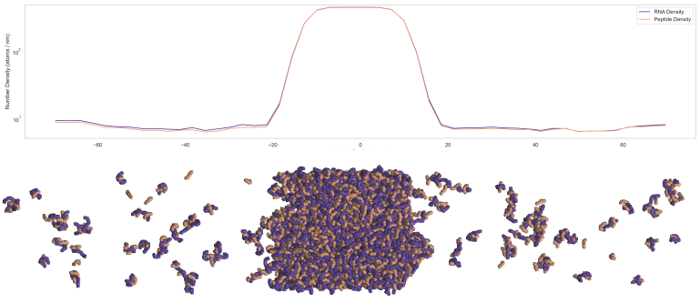

OpenMM implementation of Mpipi-Recharged residue level potential: https://pubs.acs.org/doi/10.1021/acscentsci.4c01617

Installation instructions:

1) Create a new conda environment, activate the new environment and install OpenMM using conda specifying the version of cuda corresponding to your installed CUDA driver version.
2) Clone this repo, activate the new conda environment and use the command `python -m pip install .` from within the root dir to install on top of your openmm install

